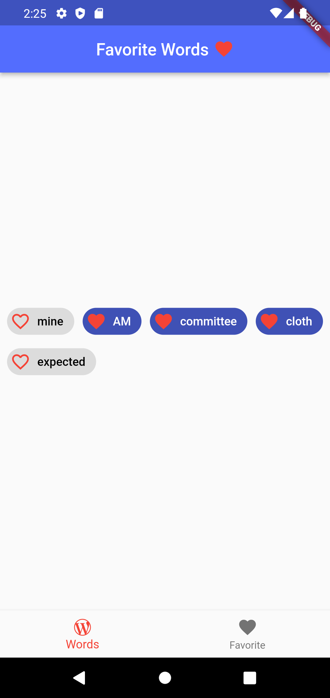
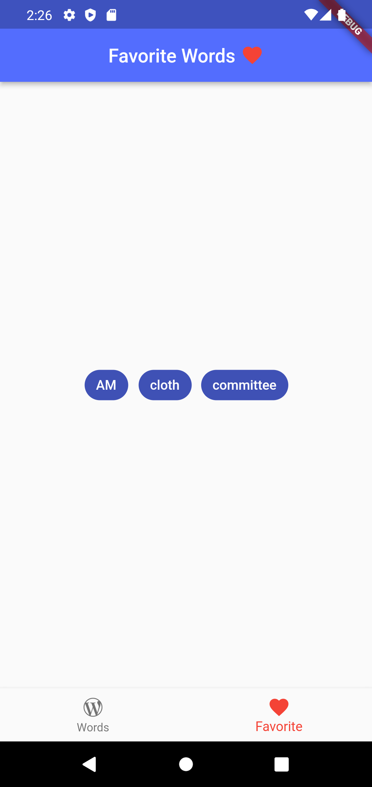

# Добавляем в израбнное рандомное слово на BLoC ❤️

Реализовал два bloc'а:
 - первый для навигации;
 - второй для chip

Используемые пакеты:
  bloc: ^8.0.3
  flutter_bloc: ^8.0.1
  english_words: ^4.0.0
  
Конспект: https://peach-hole-317.notion.site/3-BottomNavBar-BLoC-e968fbe889874a639ea883529a1913a4

